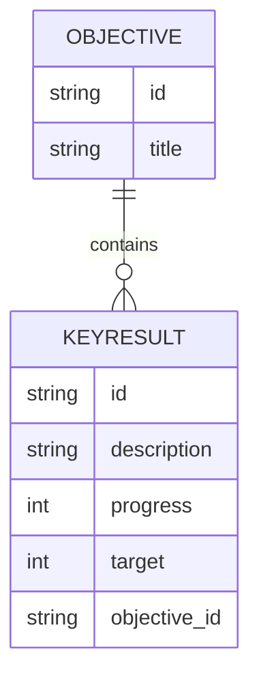

```mermaid
erDiagram
    OBJECTIVE ||--o{ KEYRESULT : contains
    KEYRESULT
    OBJECTIVE {
        string id
        string title
    }
    KEYRESULT {
        string id
        string description
        int progress
        int target
        string objective_id
    }

```
